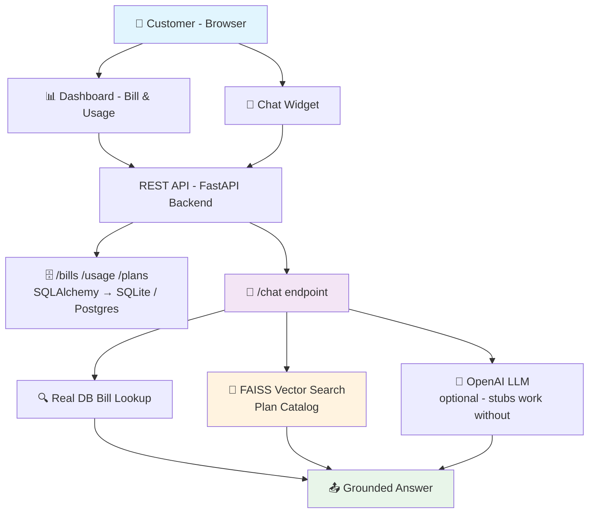

<div align="center">

# 💳 Wallet & Bill Agent

### Full-Stack Billing Dashboard · AI Chat Agent · FAISS Plan Matching

[](https://nextjs.org/)
[](https://fastapi.tiangolo.com/)
[](https://www.typescriptlang.org/)
[](https://faiss.ai/)
[](./tests/)
[](./tests/)
[](https://github.com/AIstar007/wallet-bill-agent/actions/workflows/ci.yml)
[](LICENSE)

<br/>

> **A billing dashboard + AI chat agent that explains charges and finds a better plan —**  
> **grounded in real DB data and real vector search, not mock responses.**

<br/>

> 🏆 Built for **[The Talent Hack](https://www.hackerearth.com/)** · Deutsche Telekom Digital Labs · AI Full Stack Engineer Track  
> See [`SUBMISSION.md`](./SUBMISSION.md) for the full hackathon write-up and architecture rationale.

<br/>

[🚀 Quick Start](#-quick-start) · [🏗️ Architecture](#️-architecture) · [💬 Agent Capabilities](#-agent-capabilities) · [🧪 Testing](#-testing) · [📂 Project Structure](#-project-structure) · [🎨 Design Notes](#-design-notes)

</div>

---

## ✨ What It Does

A customer opens the dashboard and sees their current bill, usage history, and a chat panel. They ask — the agent answers from **real data**:

| Query | How It's Answered |
|---|---|
| *"Why is my bill higher this month?"* | Real bill breakdown pulled from DB — not a canned response |
| *"I need a cheaper plan with less data"* | FAISS vector search over the plan catalog — not a hardcoded lookup |
| *"I need a family plan for 4 lines"* | Similarity-ranked plan match that surfaces the correct option |

> 🔒 **The agent only recommends — it never executes.** No plan switches, no refunds. Same "propose, don't act" safety pattern across all hackathon submissions.

---

## 🏗️ Architecture



### System Layout

```
┌─────────────── Frontend (Next.js 14 + TypeScript + Tailwind) ───────────────┐
│        Dashboard (bill, usage history)    │     Chat Widget                  │
└────────────────────┬───────────────────────────────────┬────────────────────┘
                     │ REST                               │ REST
                     ▼                                    ▼
┌──────────────────────────── Backend (FastAPI) ──────────────────────────────┐
│  /bills  /usage  /plans  — SQLAlchemy → SQLite (dev) / Postgres (prod)      │
│  /chat   — real DB bill lookup + FAISS vector search over plan catalog       │
└─────────────────────────────────────────────────────────────────────────────┘
```

---

## 💬 Agent Capabilities

<table width="100%">
<tr>
<td width="50%" valign="top">

#### **📊 Bill Explanation**
```yaml
Trigger: "Why is my bill higher?"

Data source:
  - Real DB query via SQLAlchemy
  - Bill breakdown per line item
  - Usage records for the period

Method:
  - /chat → DB bill lookup
  - Context passed to OpenAI LLM
  - Stub fallback if no API key

Output:
  - Itemized charge explanation
  - Grounded in real account data
  - No hallucinated amounts
```

</td>
<td width="50%" valign="top">

#### **📋 Plan Recommendation**
```yaml
Trigger: "I need a cheaper / family plan"

Data source:
  - FAISS index over plan catalog
  - Offline hashing embedder
  - No external model download

Method:
  - Query → embed → FAISS search
  - Similarity-ranked plan list
  - Top match passed to LLM

Output:
  - Best-match plan recommendation
  - Ranked by semantic similarity
  - Proposal only — never executes
```

</td>
</tr>
</table>

---

## 🚀 Quick Start

### Backend

```bash
cd backend
pip install -r requirements.txt
uvicorn main:app --reload
```

> ✅ **Demo data seeds automatically on startup** — idempotent via Fast `lifespan` handler. Safe to restart as many times as needed.

### Frontend

```bash
cd frontend
npm install
npm run dev
```

Visit `http://localhost:3000`.

### (Optional) Add Azure OpenAI Key

```bash
cp backend/.env.example backend/.env
# Add AZURE_OPENAI_API_KEY, AZURE_OPENAI_ENDPOINT, AZURE_OPENAI_API_VERSION, AZURE_OPENAI_DEPLOYMENT to backend/.env
```

> ✅ **Zero setup required to see it work** — `/chat` falls back to stub answer text if no `AZURE_OPENAI_API_KEY` is set. Bill lookup, DB queries, and FAISS plan matching are all real regardless.

### Docker Compose (full stack + Postgres)

```bash
docker compose up --build
```

> ⚠️ **Docker build context:** `backend/Dockerfile` uses package-qualified imports (`backend.main:app`), so it must be built from the **repo root** with `-f backend/Dockerfile`, not from inside `backend/`. `docker-compose.yml` and CI are both configured correctly for this.

---

## 🧪 Testing

```bash
cd backend
pip install -r requirements-dev.txt
cd ..
pytest tests/ --cov=backend --cov-report=term-missing
```

**19 tests · 93% coverage**

| Module | Tests | What's Covered |
|--------|-------|----------------|
| REST API layer | 6 | `/bills`, `/usage`, `/plans`, `/chat` endpoints |
| DB seeding | 4 | Idempotency, data integrity, lifespan handler |
| FAISS search index | 5 | Embedding, indexing, similarity ranking |
| Chat grounding | 4 | DB lookup + FAISS + stub/real LLM routing |

---

## 📂 Project Structure

```
wallet-bill-agent/
│
├── 📁 backend/
│   ├── main.py               # FastAPI app, lifespan DB seeding, configurable CORS
│   ├── db.py                 # SQLAlchemy engine + session
│   ├── models.py             # Account, Plan, Bill, UsageRecord
│   ├── seed.py               # Idempotent demo data seeding
│   ├── plan_search.py        # Offline hashing embedder + FAISS index
│   ├── llm.py                # OpenAI client wrapper (only wired in when key present)
│   └── routers/
│       ├── bills.py          # /bills /usage /plans — real DB queries, 404 handling
│       └── chat.py           # /chat — real DB + FAISS grounding
│
├── 📁 frontend/
│   ├── app/page.tsx          # Dashboard — bill + usage view
│   └── components/
│       └── ChatWidget.tsx    # Chat panel
│
├── 📁 tests/                 # 19 tests — API, DB, FAISS
├── docker-compose.yml        # Full stack + Postgres
├── SUBMISSION.md             # Hackathon write-up + rationale
└── .env.example
```

---

## 🎨 Design Notes

### Real DB-Backed Endpoints — No Mock Dicts
`/bills`, `/usage`, and `/plans` are real SQLAlchemy-backed endpoints seeded automatically and idempotently via a FastAPI `lifespan` handler (not the deprecated `on_event`). Every query hits the actual DB.

### FAISS Plan Matching — No Static Lookup
Plan recommendations use a real FAISS index, not a hardcoded list. The same dependency-free offline hashing embedder pattern from the `telecom-support-agent` submission is reused here — zero external model downloads, works in network-locked environments.

### Configurable URLs — Actually Deployable
API base URL is configurable via `NEXT_PUBLIC_API_URL` (not hardcoded to `localhost:8000`). Backend CORS is configurable via `FRONTEND_ORIGIN`. Both sides are deploy-ready, not just localhost-ready.

### Injectable LLM — Testable Without an API Key
The `/chat` endpoint conditionally wires in the real OpenAI client only when `AZURE_OPENAI_API_KEY` is present. Without it, stub answer text is returned while DB lookup and FAISS search still execute — making the full pipeline testable with zero external dependencies.

---

## 🗺️ Roadmap

| Feature | Status |
|---------|--------|
| Auth — DTDL SSO integration | 🔜 Planned |
| Real bill/usage data source integration | 🔜 Planned |
| Token streaming on `/chat` | 🔜 Planned |
| pgvector / managed vector DB for production scale | 🔜 Planned |

---

## 🧱 Tech Stack

| Layer | Technology |
|-------|------------|
| Frontend | [Next.js 14](https://nextjs.org/) + [TypeScript](https://www.typescriptlang.org/) + [Tailwind CSS](https://tailwindcss.com/) |
| Backend | [FastAPI](https://fastapi.tiangolo.com/) |
| Database | [SQLAlchemy](https://www.sqlalchemy.org/) → SQLite (dev) / Postgres (prod) |
| Vector Search | [FAISS](https://faiss.ai/) + offline hashing embedder |
| LLM | [OpenAI](https://openai.com/) — optional, stubs work without it |
| Testing | [pytest](https://pytest.org/) + FastAPI `TestClient` |
| CI | GitHub Actions |
| Containerization | Docker Compose |

---

<div align="center">

Built with ❤️ for Deutsche Telekom Digital Labs · The Talent Hack

[⭐ Star this repo](https://github.com/AIstar007/wallet-bill-agent) · [🐛 Report an Issue](https://github.com/AIstar007/wallet-bill-agent/issues) · [📄 Submission Write-up](./SUBMISSION.md)

</div>
